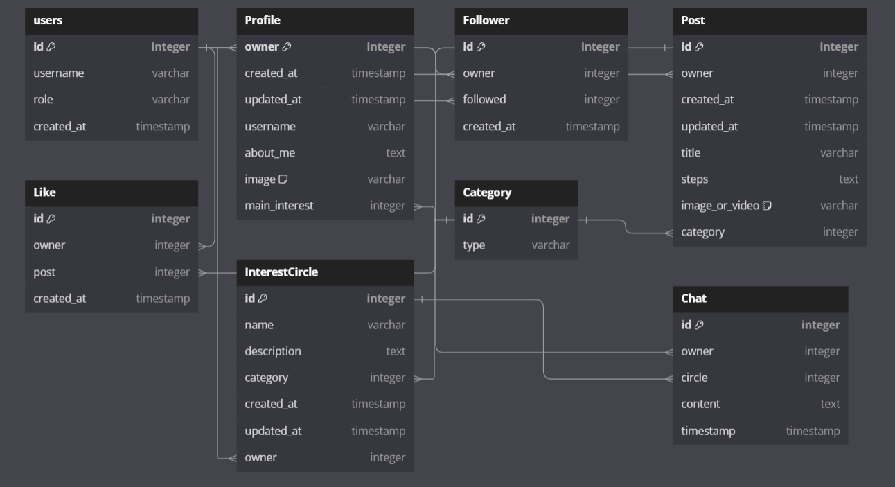

# Learn with Me

Welcome to **Learn with Me**, the ultimate learning app designed to empower users by sharing and discovering knowledge. Whether you're a student, professional, or lifelong learner, this app is your go-to platform for mastering new skills and expanding your horizons.

## What is *Learn with Me*?

*Learn with Me* is more than just a learning tool—it's a vibrant community where you can:

- **Share Your Wisdom:** Post your own tips, tricks, and insights to help others learn more effectively.
- **Discover New Ideas:** Browse and interact with posts from fellow users to gain fresh perspectives and innovative techniques.
- **Connect and Collaborate:** Join discussions and chat with people who share your interests, fostering a collaborative learning environment.

## Planning

- **Home/Feed**: 
  - This page will display a list of different users' posts.
  - It will serve as the main/home page. Starting here helps set a standard design for the rest of the app.
  - Consider a unique approach for the navbar: use a side component for navigation on larger screens, while maintaining a standard mobile navbar for smaller screens.

- **Profile**:
  - This page will show the current user's profile information.
  - It will include recent posts, recent likes, and counts for followers and following.
  - Aim to consolidate all necessary user information and relevant actions in one place.

- **Interest Circles**:
  - This page will act as a groups component, bringing users with similar interests together.
  - The design should be straightforward and aligned with the 'Circles' concept to ensure clarity and usability.

- **Chats**:
  - This will be a sub-page of Interest Circles, where users can read messages posted by others in the circle.
  - Keep the design simple and user-friendly, consistent with common social media chat interfaces.

#### Design

##### Home/Feed

- Start with this page to set the standard for the app's design.
- Consider incorporating a side navigation component for larger screens, while ensuring compatibility with standard mobile navigation.
  
  

##### Profile

- Design to include essential user information and recent activities, such as posts and likes.
- Ensure easy access to profile management, privacy settings, and activity logs.
  
  

##### Interest Circles

- Focus on clarity and ease of use for navigating and interacting with interest circles.
- Design should emphasize community and make it simple to join or view different circles.
  
  

##### Chats

- Keep the chat page straightforward, focusing on user conversations.
- Consider features like message search, reactions, or pinned messages if applicable.
  
  

#### Logic

- Using an online tool I was able to map out my database and get a better idea of what relationships were present between tables

#### User Stories

##### Backend

1. **Profile Model**
   - **Issue #2**
2. **Post Model**
   - **Issue #3**
3. **Messages Model**
   - **Issue #4**  
4. **Circles Model**
   - **Issue #5**
5. **Like Model**
   - **Issue #6**
6. **CRUD Operations for Posts API**
   - **Issue #7**
7. **CRUD Operations for Messages API**
   - **Issue #8**
8. **CRUD Operations for Circles API**
   - **Issue #9**
9. **CRUD Operations for User Profiles API**
   - **Issue #10**
10. **User Registration**
    - **Issue #11**
11. **User Login API**
    - **Issue #12**
12. **Filter Posts by Categories API**
    - **Issue #14**
13. **Pagination for Feeds API**
    - **Issue #15**
14. **Pagination for Groups API**
    - **Issue #16**
15. **Followers Model**
    - **Issue #17**

##### Frontend

1. **Reusable Components**
   - **Issue #1**  
2. **State Management**
   - **Issue #2**  
3. **Routing**
   - **Issue #3**
4. **Forms and Validation**
   - **Issue #4**  
5. **Media Handling**
   - **Issue #5**  
6. **Infinite Scroll**
   - **Issue #6**  
7. **View Profile Page**
   - **Issue #7**  
8. **View Interest Circles**
   - **Issue #8**  
9. **View Chats**
   - **Issue #9**  
10. **Create a Post**
    - **Issue #11**  
11. **Follow Profile**
    - **Issue #12**  
12. **Pagination for Feeds API**
    - **Issue #13**

#### Tailwind CSS 

##### **Design Flexibility**
Tailwind CSS provides a utility-first approach that offers granular control over styling directly in your HTML. This means you can create custom designs easily and adjust styles without being limited by predefined components. If your project requires a unique design or complex layouts, Tailwind’s flexibility is a significant advantage.

##### **Customizability**
Tailwind CSS excels in customizability. Its configuration file (tailwind.config.js) allows you to define your own design system, including colors, spacing, and breakpoints. This level of customization can help you create a unique brand identity and tailor the framework to meet specific design requirements, without needing to override a lot of existing styles as you might with Bootstrap.

##### **File Size and Performance**
Tailwind CSS's build process includes tools like PurgeCSS to remove unused styles from the final build. This results in smaller CSS file sizes and potentially faster load times for your application. In contrast, Bootstrap’s default build includes many components and styles, which can lead to larger CSS files if not carefully managed.

##### **Summary**
Design Flexibility: Tailwind allows for highly customized and unique designs.
Customizability: Tailwind’s configuration file provides extensive options for tailoring the design system.
File Size and Performance: Tailwind’s purging mechanism helps keep the CSS file size minimal, improving performance.
These reasons make Tailwind CSS a strong choice if a project values flexibility, customizability, and performance.

## Existing Features

- **Sidebar/Navigation Bar**
  - The Sidebar replaces the previous Navigation Bar.
  - The Sidebar displays different icons based on your authentication status:
    - **Logged In**: Home, Interest Circles, Create a Post, Profile Icon, Log Out icon.
    - **Logged Out**: Home, Sign In, Sign Up.
  - The Sidebar is collapsible; even when closed, the icons remain functional as links, so users don't need to expand the Sidebar to change pages.

  
  

- **Feed Page**
  - The Feed Page is the landing page for users accessing the app.
  - It displays a list of post cards, with each card linking to the post details page via the post name.
  - Logged-in users can view the post owner's profile page by clicking on the top of the card.
  - Logged-in users can also like posts directly from the Feed Page. Liked posts will display as "Unliked" with a blue color to indicate their status.

  
  
  

- **Profile Page**
  - The Profile Page displays the user's personal information:
    - Profile Name
    - Profile Picture
    - About Me
    - Follower Count
    - Following Count
    - Depending on whether the user owns the profile:
      - If the owner: Edit Button
      - If not the owner: Follow/Unfollow Button
    - Users can search through their previous posts, sorted by most recent first.
    - The Recent Likes section shows the user's last 10 likes.

  

- **Interest Circles Page**
  - The Interest Circles Page is designed for clarity.
  - Each circle displays the interest name, owner, and an info button that shows the circle's description when clicked.
  - If the logged-in user owns the circle, they have the option to delete or edit the circle via a modal.

  
  

- **Chat Page**
  - The Chat Page features a simple message interface with a white background for readability.
  - Messages are displayed in a list, starting with the most recent messages at the top. Users can scroll back through older messages.
  - Message owners have edit and delete icons on their messages. Selecting "Edit" allows them to modify their message directly in the input field below, removing the need for a modal and making the process more seamless.

  
  
  

- **Error Modal**
  - The Error Modal handles various errors across different pages.

  

- **Delete Modal**
  - The Delete Modal is used for handling deletions across multiple pages.

  

- **Sign In Page**
  - I wanted the Sign In process to be quick and easy so I just went with a standard login card but to make it easier for people I added a Show/Hide button for password so User can check for any password errors before subbmitting the login.

  
  

- **SignUp Page**
  - Allows new users to create an account by entering a username and password.
  - Simple and clean form layout for ease of use and clear focus on registration.
  - Ensures passwords match before submission, providing immediate feedback.

  

- **Loading Spinner**
  - I added a loading spinner for cases of the app running slow.

## Features Left to Implement

- 

## Testing

- **Browser Testing**
  - List the browsers tested and the results of the testing.

- **Responsiveness**
  - Explain how responsiveness was tested and the tools used.

- **Form Validation**
  - Detail the testing and results of form validation.

### Validator Testing

- **HTML**
  - Provide a link to the HTML validation results.

- **CSS**
  - Provide a link to the CSS validation results.

- **Js**
  - Provide a link to the Js validation results.

- **Python**
  - Provide a link to the Python validation results.

### Bugs Faced

- Describe any bugs encountered during development and how they were addressed.

### Bugs Yet to Fix

- List any unresolved issues and potential plans for addressing them.

## Deployment

### API Deployment

Deploying an API involves setting up a server to host your backend application. The API can be deployed to various cloud platforms or hosting services. Here’s a general outline for deploying an API:

1. **Prepare Your API:**
   - Ensure that your API is production-ready. This includes handling errors gracefully, configuring environment variables, and securing your endpoints.
   - Test your API locally to confirm that it behaves as expected.

2. **Choose a Hosting Platform:**
   - Select a cloud provider or hosting service for deploying your API. Common choices include AWS, Azure, Google Cloud, DigitalOcean, or Heroku.

3. **Deploy the API:**
   - **Upload Your Code:** Transfer your API code to the chosen hosting platform. This can be done through a CI/CD pipeline, FTP, or directly from your local machine.
   - **Configure the Environment:** Set up environment variables, database connections, and other necessary configurations.
   - **Run Migrations:** If your API relies on a database, run any necessary migrations to set up the schema.

4. **Monitor and Maintain:**
   - **Monitoring:** Use monitoring tools to track performance and errors.
   - **Scaling:** Adjust resources based on demand to ensure your API handles traffic efficiently.
   - **Updates:** Regularly deploy updates to improve functionality and fix bugs.

### GitHub

GitHub is a platform for version control and collaboration, using Git. It’s essential for managing your codebase and collaborating with other developers. Here’s how to set up and use GitHub for your project:

1. **Create a Repository:**
   - **Create a New Repository:** Go to GitHub, create a new repository for your project, and initialize it with a README, .gitignore, and license if needed.
   - **Clone the Repository:** Clone the repository to your local machine to start working on your project.

2. **Push Your Code:**
   - **Add Your Code:** Add your project files to the local repository.
   - **Commit Changes:** Commit your changes with descriptive messages.
   - **Push to GitHub:** Push your commits to the remote repository on GitHub.

3. **Collaborate:**
   - **Branches:** Use branches to work on new features or fixes separately from the main codebase.
   - **Pull Requests:** Submit pull requests to review and merge changes into the main branch.
   - **Issues and Discussions:** Use GitHub Issues and Discussions to track bugs, feature requests, and collaborate with your team.

4. **Integrate with CI/CD:**
   - Set up Continuous Integration (CI) and Continuous Deployment (CD) workflows using GitHub Actions or other CI/CD tools to automate testing and deployment.

### Heroku

Heroku is a cloud platform that simplifies deployment and scaling of applications. Here’s how to deploy a project to Heroku:

1. **Set Up Heroku:**
   - **Create a Heroku Account:** Sign up for an account at [Heroku](https://www.heroku.com/).
   - **Install the Heroku CLI:** Download and install the Heroku Command Line Interface (CLI) for interacting with Heroku from your terminal.

2. **Prepare Your Application:**
   - **Procfile:** Create a `Procfile` in the root directory of your project to define the commands that Heroku should run to start your application.
   - **Dependencies:** Ensure all dependencies are listed in `requirements.txt` (for Python) or `package.json` (for Node.js).

3. **Deploy to Heroku:**
   - **Login:** Use the Heroku CLI to log in with `heroku login`.
   - **Create an App:** Run `heroku create` to create a new Heroku app.
   - **Push Code:** Push your code to Heroku using `git push heroku main` (or `git push heroku master` if your branch is named `master`).
   - **Set Up Environment Variables:** Configure environment variables using `heroku config:set` for your application settings.

## Credits

### Code

- The Idea for protected routes came from [Medium](https://medium.com/@yogeshmulecraft/implementing-protected-routes-in-react-js-b39583be0740)
- All the inline styles have come from [Tailwind](https://tailwindcss.com/docs/)
- How to set the [verbose_name](https://docs.djangoproject.com/en/1.10/ref/models/options/#verbose-name) for Categories

### Content

- The wirframes for this project were created with [Wirframe](https://wireframe.cc/)
- Database Schema was created using [Database Schema](https://dbdiagram.io/)

### Media

- Provide credits for any media (images, videos, etc.) used in the project.
