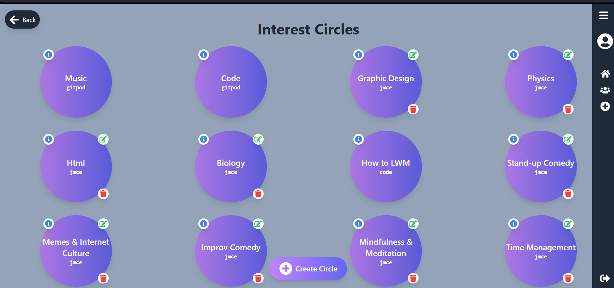

# Learn with Me


[Learn With Me](https://learn-with-me-593ba116ca81.herokuapp.com)

[LWM-API](https://github.com/JAmcevoy/LWM-API)

Welcome to **Learn with Me**, the ultimate learning app designed to empower users by sharing and discovering knowledge. Whether you're a student, professional, or lifelong learner, this app is your go-to platform for mastering new skills and expanding your horizons.

## What is *Learn with Me*?

*Learn with Me* is more than just a learning tool—it's a vibrant community where you can:

- **Share Your Wisdom:** Post your tips, tricks, and insights to help others learn more effectively.
- **Discover New Ideas:** Browse posts from fellow users to gain fresh perspectives and innovative techniques.
- **Connect and Collaborate:** Join discussions and chat with like-minded individuals, fostering a collaborative learning environment.

## Planning

### Pages Overview

- **Home/Feed**: 
  - Displays a list of user posts and serves as the main landing page.
  - A sidebar navigation component is used for larger screens, while a standard mobile navbar is available for smaller screens.

- **Profile**:
  - Displays user profile information, recent posts, likes, and follower/following counts.
  - Allows users to easily manage profile-related actions.

- **Interest Circles**:
  - Acts as a groups component to bring users with similar interests together.
  - Design focuses on clarity, making it easy to join and navigate various circles.

- **Chats**:
  - Embedded within Interest Circles, this sub-page allows users to communicate with others in the circle.
  - A simple and user-friendly design keeps the chat intuitive.

### Design

#### Home/Feed

- Set as the design standard for the app. 
- Responsive side navigation is incorporated for larger screens.


#### Profile

- Displays essential user information such as recent activity and posts.
- Includes easy access to profile management options.


#### Interest Circles

- Clear and easy-to-use design for navigating interest circles.


#### Chats

- Focused on user conversations, the chat page is simple, with potential additions like message search and reactions in the future.


---

### Tailwind CSS 

#### Why Tailwind CSS?

##### **Design Flexibility**
Tailwind CSS provides utility-first styling, which gives granular control directly in the HTML. This is great for creating custom designs easily without being restricted by predefined components.

##### **Customizability**
Tailwind’s configuration file allows for defining your own design system, including colors, spacing, and breakpoints. This flexibility is a significant advantage when compared to frameworks like Bootstrap.

##### **File Size and Performance**
Tailwind CSS uses PurgeCSS to remove unused styles from the final build, resulting in smaller CSS files and faster load times. This helps keep the performance optimal, unlike Bootstrap's larger default builds.

##### **Summary**
- **Design Flexibility**: Allows for unique and customized designs.
- **Customizability**: Extensively tailors the design system to your project needs.
- **Performance**: Smaller, faster CSS builds due to Tailwind’s purging mechanism.

##### Install Tailwind CSS

**Step 1**: Install Tailwind CSS
- Open your terminal and navigate to your React project directory.
- Install **Tailwind CSS**, **PostCSS**, and **Autoprefixer** as development dependencies using npm (Node Package Manager).

  ```
    npm install -D tailwindcss postcss autoprefixer
  ```

**Step 2**: Generate Configuration Files
- After installation, generate the necessary configuration files for Tailwind by running the initialization command.

  ```
    npx tailwindcss init -p
  ```

- This will create two important files:
  - **`tailwind.config.js`**: This file is used to customize Tailwind's default settings.
  - **`postcss.config.js`**: This file is used to configure PostCSS, including adding plugins like Autoprefixer.

**Step 3**: Set Up Purging for Unused CSS
- In your **`tailwind.config.js`** file, configure the paths where your React components are located.
- This will ensure that Tailwind CSS removes any unused styles in production, reducing file size and improving performance.

    ```
      module.exports = {
      purge: ['./src/**/*.{js,jsx,ts,tsx}', './public/index.html'],
      darkMode: false, // or 'media' or 'class'
      theme: {
        extend: {},
      },
      plugins: [],
  }
    ```

**Step 4**: Import Tailwind CSS Styles
- Open your main CSS file (e.g., **`src/index.css`**) and import Tailwind's base, components, and utilities.
- This will integrate Tailwind's utility-first classes into your project.

  ```
  @tailwind base;
  @tailwind components;
  @tailwind utilities;
  ```

---

### User Stories

Using the issues tab in Github I created user stories for both the frontend and the backend devlopement. Using the tags fucntion I was able to assign them specfic tags based on their fucntionality, in an agile development this would be use full to assign task and time based on skill and the importance of the feature.

#### Backend

1. **Profile Model**
   - **Issue #2**
2. **Post Model**
   - **Issue #3**
3. **Messages Model**
   - **Issue #4**  
4. **Circles Model**
   - **Issue #5**
5. **Like Model**
   - **Issue #6**
6. **CRUD Operations for Posts API**
   - **Issue #7**
7. **CRUD Operations for Messages API**
   - **Issue #8**
8. **CRUD Operations for Circles API**
   - **Issue #9**
9. **CRUD Operations for User Profiles API**
   - **Issue #10**
10. **User Registration**
    - **Issue #11**
11. **User Login API**
    - **Issue #12**
12. **Filter Posts by Categories API**
    - **Issue #14**
13. **Pagination for Feeds API**
    - **Issue #15**
14. **Pagination for Groups API**
    - **Issue #16**
15. **Followers Model**
    - **Issue #17**


#### Frontend

1. **Reusable Components**
   - **Issue #1**  
2. **State Management**
   - **Issue #2**  
3. **Routing**
   - **Issue #3**
4. **Forms and Validation**
   - **Issue #4**  
5. **Media Handling**
   - **Issue #5**  
6. **Infinite Scroll**
   - **Issue #6**  
7. **View Profile Page**
   - **Issue #7**  
8. **View Interest Circles**
   - **Issue #8**  
9. **View Chats**
   - **Issue #9**  
10. **Create a Post**
    - **Issue #11**  
11. **Follow Profile**
    - **Issue #12**  
12. **Pagination for Feeds API**
    - **Issue #13**

Once the Stories were setup I then created a project [LearnWithMe User Stories](https://github.com/users/JAmcevoy/projects/4/views/3). Using the kanban view, I will able to drag and drop stories under progress heading to remind me of what stages what feature were at. 


## Features

### Existing Features

- **Sidebar/Navigation Bar**
  - The Sidebar replaces the previous Navigation Bar.
  - The Sidebar displays different icons based on your authentication status:
    - **Logged In**: Home, Interest Circles, Create a Post, Profile Icon, Log Out icon.
    - **Logged Out**: Home, Sign In, Sign Up.
  - The Sidebar is collapsible; even when closed, the icons remain functional as links, so users don't need to expand the Sidebar to change pages.

  
  
  

  
  
  

- **Feed Page**
  - The Feed Page is the landing page for users accessing the app.
  - It displays a list of post cards, with each card linking to the post details page via the post name.
  - Logged-in users can view the post owner's profile page by clicking on the top of the card.
  - Logged-in users can also like posts directly from the Feed Page. Liked posts will display as "Unliked" with a blue color to indicate their status.

  
  

- **Profile Page**
  - The Profile Page displays the user's personal information:
    - Profile Name
    - Profile Picture
    - About Me
    - Follower Count
    - Following Count
    - Depending on whether the user owns the profile:
      - If the owner: Edit Button
      - If not the owner: Follow/Unfollow Button
    - Users can search through their previous posts, sorted by most recent first.
    - The Recent Likes section shows the user's last 10 likes.

  
  


- **Interest Circles Page**
  - The Interest Circles Page is designed for clarity.
  - Each circle displays the interest name, owner, and an info button that shows the circle's description when clicked.
  - If the logged-in user owns the circle, they have the option to delete or edit the circle via a modal.

  
  
  


- **Chat Page**
  - The Chat Page features a simple message interface with a white background for readability.
  - Messages are displayed in a list, starting with the most recent messages at the top. Users can scroll back through older messages.
  - Message owners have edit and delete icons on their messages. Selecting "Edit" allows them to modify their message directly in the input field below, removing the need for a modal and making the process more seamless.

  
  
  

- **Error Modal**
  - The Error Modal handles various errors across different pages.

  

- **Delete Modal**
  - The Delete Modal is used for handling deletions across multiple pages.

  

- **Sign In Page**
  - I wanted the Sign In process to be quick and easy so I just went with a standard login card but to make it easier for people I added a Show/Hide button for password so User can check for any password errors before subbmitting the login.

  

- **SignUp Page**
  - Allows new users to create an account by entering a username and password.
  - Simple and clean form layout for ease of use and clear focus on registration.
  - Ensures passwords match before submission, providing immediate feedback.

  

- **Loading Spinner**
  - I added a loading spinner for cases of the app running slow.


- **Search Bar**
  - The SearchBar component is a customizable search input that allows users to search based on titles or owner names. It features a clear button that appears when a query is entered, enabling users to quickly reset their search filters.


- **Go Back Button**
  - The BackButton component is a fixed-position button that allows users to navigate to the previous page in their browser history. It features an arrow icon and is designed to be both accessible and intuitive.
  - The button was a bit awkward to fit on small screens, so I removed it for small screen sizes.


- **SweetAlert**
  - SweetAlert was integrated to provide elegant and customizable pop-up alerts for actions such as confirming deletions, form submissions, or displaying success and error messages. SweetAlert enhances user experience with a clean and simple alert interface compared to traditional browser alerts.

  

---

### Features Left to Implement

- Originally, I wanted to enable posts to handle both video and image uploads. However, I found it difficult to implement multimedia operations for anything other than images. This is a feature I would prioritize for future development, given the nature of the platform.
- I planned to implement a share button to allow users to share posts directly to an interest circle or externally by copying the link.
- A notification system is needed to alert users when their posts are liked, commented on, or shared, when they are followed, or when new posts are made in circles they follow.
- **Private Messaging**: I would like to allow users to send direct messages to one another, fostering more personal interactions outside of public posts.
- **Private/Public Circles**: Introducing private circles that require either a password or approval from the group's owner would enhance community management.
- **File Attachments in Chats**: Allowing users to attach documents or other files in chat messages would add another layer of collaboration.
- **Search bar In Circles** I wanted to add a search bar to circle but I couldnt find a place to put it, If I had more timeto design I might find a spot to fit it in.

---

## Bugs

### Bugs I Faced Along the Way

1. **Slow Loading Times for Large Feeds**: Implemented lazy loading and infinite scroll to handle large amounts of posts and improve performance.
2. **Chat Page Layout on Mobile**: Addressed layout issues on mobile devices with responsive CSS to ensure a consistent chat interface.
3. **Go Back Button Visibility on Small Screens**: Adjusted the button size and position to improve accessibility on mobile.
4. **React Logout Bug**: Encountered a known bug in React where users can sometimes experience issues logging out due to client-side caching or session persistence. This issue occurs when React fails to fully clear the user’s session or authentication state. A workaround was implemented by manually clearing the local storage and session data on logout, but the issue can still occasionally persist under certain conditions.
5. **Circle and Message Handling in DRF**: Initially, when accessing a specific circle, the API would only pull a single message by its ID rather than all the messages associated with that circle. To fix this, I had to create a new endpoint in Django REST Framework (DRF) to handle the proper flow: from the main page > Interest Circles > specific circle > retrieving all chats related to that circle. This change ensures that when a user navigates to a circle, they can see the entire chat history instead of just a single message, improving the overall user experience.
6. **Pulling User’s Recent Posts and Likes**: I encountered difficulties retrieving a specific user's recent posts and recent likes for their profile page. Initially, the query was not pulling the correct data, but by creating custom fields in the serializer, I was able to resolve this issue. This approach allowed me to accurately display both recent posts and likes on the profile page, ensuring that the sections worked as intended.
7. **Pagination on Categories**: Initially, the categories were paginated, and I was limited to displaying only 10 categories. I fixed this by fetching all the categories before rendering the dropdown, ensuring that users could see the full list of categories at once.
8. **Not Enough Space on Navbar**: On smaller screens, not all icons and text fit in the navbar. To resolve this, I created a media query that hides the text on screens under 530px, ensuring the navbar remains clean and functional on small devices.
9. **The Default Image For New Profile**: When a user created a new profile the deafult image wouldnt show, Turns out the pathway in the backend was incorrect.

---

### Bugs Yet to Fix

1. **Error Handling for Network Issues**: Need to implement better notifications for lost network connections or server downtime.
2. **Video Upload Handling**: Video uploads are not yet supported due to difficulties with file size management. So the backend still has the potitienal to add video.
3. **Go Back Button**: Although functional, it still requires further adjustments to improve usability on smaller screens, for now on smaller screen I put it in the navbar. Additionally, the back button pushes back through all previous pages, including forms, instead of stopping at the home page. This can cause the user to continue navigating back farther than expected.
4. **The Sort Order of Chats**: The chat function was difficult to implement correctly, particularly with loading messages in the right order (starting from the bottom with older messages above). Currently, the chat loads at the top and scrolls to the bottom, which may cause a poor user experience in chats with many users.
5. **Circle Name Visibility in Chats**: When entering a chat with no messages, the circle name does not show until a message is sent. This can confuse users as they may not immediately recognize which circle they are in.
6. **401 Unauthorized Error for manifest.json**: The manifest.json file should be publicly accessible, but it is currently returning a 401 error, indicating that authentication is required to access it. This needs to be fixed by ensuring the file is served publicly.
7. **WebSocket Connection Failed**: WebSocket connection issues (`ERR_CONNECTION_TIMED_OUT`) have occurred due to an unreachable or incorrectly configured WebSocket server. This issue remains unresolved and needs further debugging to ensure proper WebSocket communication.
8. **Sorting of Circles After Editing**: When a user edits a circle, the page refreshes and pushes the most recently edited circle to the bottom of the page. This creates a poor user experience, but I currently lack the knowledge to fix it. The desired behavior is to maintain the circle's original position after editing or to allow for customizable sorting.
9. **The Circles List View** The circles list is kind of messy and unless you know what to look for it might be hard to locate and when you go into a circle and back out it bring you back to the top making it difficult for user to pop in and out of chats easily.
10. **Chats Refresh** When multiple users are in a chats it doesnt auto refresh for other users the user has to phyically refresh the page to see updated messages. I just dont have the knowledge right now to complete this!
11. **Large React File**: Some of the components, particularly the pages like the chat page, became too large because I was unable to properly refactor and break them up into separate components and hooks. While trying to clean this up, I encountered issues and ultimately ran out of time to fully address this. As a result, files like the chat component contain a lot of code in one place, which is not ideal and does not adhere to React's best practices for clean and maintainable code. This is something that needs to be refactored in the future.

---

## Testing

### Manual Testing

#### Frontend Testing (React)

1. **Navigation**: Tested navigation between Home, Profile, Interest Circles, and Chats.  
   **Result**: All links directed to the correct pages.
   
2. **User Registration and Login**: Tested user registration, login, logout, and restricted page access.  
   **Result**: All functionalities worked as expected, with appropriate redirects for restricted pages.

3. **Profile Page**: Tested editing and viewing profile information.  
   **Result**: Profile updates saved successfully and reflected immediately.

4. **Post Creation**: Tested post creation and image uploads.  
   **Result**: Posts were created and displayed correctly.

5. **Interest Circles**: Tested joining, viewing, and leaving interest circles, as well as sending messages.  
   **Result**: All circle functionalities worked as expected.

6. **Feed Page**: Tested infinite scroll, liking posts, and viewing post details.  
   **Result**: Infinite scroll and interactions with posts worked correctly.

7. **Search Bar**: Tested searching by title or owner name and clearing the search.  
   **Result**: The search bar returned accurate results, and the clear button functioned properly.

8. **Responsive Design**: Tested responsiveness across mobile, tablet, and desktop.  
   **Result**: The app scaled correctly for all screen sizes without layout issues.

#### Backend Testing (Python)

1. **User Authentication API**: Tested user registration, login, and JWT token generation.  
   **Result**: All authentication processes worked correctly.

2. **Post API**: Tested CRUD operations on posts, pagination, and filtering.  
   **Result**: All post-related operations worked without issues.

3. **Interest Circles API**: Tested circle creation, membership management, and CRUD operations.  
   **Result**: Circle functionalities worked as expected.

4. **Messaging API**: Tested message sending and receiving in interest circles.  
   **Result**: Messages were sent and received in real-time.

5. **Error Handling**: Tested API responses for unauthorized access and invalid data.  
   **Result**: Appropriate error messages were returned.

---

### User Testing

**Objective**:  
The goal of this user test is to evaluate the usability, design, and overall user experience of the Learn with Me app. The test will focus on critical components such as the Feed Page, Profile Page, Interest Circles, and the Search Bar functionality. The secondary objective is to gather user feedback on the intuitive nature of the Go Back Button for navigation.

**Test Participants**:  
- **User 1**: Casual learner, minimal tech background.  
- **User 2**: College student, moderate tech experience.  
- **User 3**: Professional developer, high tech expertise.

**Test Environment**:  
- **Devices**:  
  - User 1: Laptop  
  - User 2: Smartphone  
  - User 3: Tablet  
- **Browsers**:  
  - User 1 and User 2: Chrome  
  - User 3: Safari

**Tasks**:  
1. **Explore the Feed Page**:  
   - Scroll through posts, interact with a post by liking it, and click on a post to view its details.
2. **Search Using the Search Bar**:  
   - Search for a post by title or owner name and clear the search using the "Clear Search" button.
3. **Navigate to Profile Page**:  
   - View the user's own profile and check recent posts and likes.
4. **Join an Interest Circle**:  
   - Browse available Interest Circles, click to view the details of one, and join it.
5. **Send a Message in an Interest Circle Chat**:  
   - Navigate to a circle's chat page and send a message.
6. **Use the Go Back Button**:  
   - After completing a task, use the "Go Back" button to return to the previous screen.

**Observations & Results**:

- **User 1 (Casual Learner)**:  
  - **Feed Page**: Successfully liked a post but struggled to find where to view post details. Suggested making the clickable area larger or more distinct.  
  - **Search Bar**: Found the search feature intuitive but did not immediately notice the "Clear Search" button.  
  - **Profile Page**: Easily navigated but suggested more visual feedback when viewing likes.  
  - **Interest Circles**: Joined an interest circle without issues but found the join button too small on a laptop screen.  
  - **Chat**: Successfully sent a message but found the chat page design "a little plain" and suggested more vibrant visuals.  
  - **Go Back Button**: Worked as intended but was slightly hard to notice on smaller screens.

  **Key Takeaways**:  
  - Consider enlarging buttons or increasing contrast for important actions.  
  - Enhance visual appeal of the chat page.

- **User 2 (College Student)**:  
  - **Feed Page**: Navigated the feed smoothly and appreciated the layout.  
  - **Search Bar**: Found the search easy to use but noted that partial name searches didn’t always yield correct results. The clear button was immediately noticed.  
  - **Profile Page**: No difficulties, liked the layout but recommended a more prominent edit button.  
  - **Interest Circles**: Found the page straightforward and liked the modal for detailed info.  
  - **Chat**: Messaging was quick and easy; appreciated the edit and delete options.  
  - **Go Back Button**: Worked as expected but suggested increasing icon size on mobile.

  **Key Takeaways**:  
  - Minor improvements in mobile experience (e.g., icon sizes).  
  - Improve search results for partial matches.

- **User 3 (Professional Developer)**:  
  - **Feed Page**: Efficiently navigated and found the UI clean.  
  - **Search Bar**: Search and clear functionality worked perfectly; recommended auto-suggestions for quicker searches.  
  - **Profile Page**: No issues; liked the consolidated view of recent posts and activity.  
  - **Interest Circles**: Easy to understand and join; suggested adding filtering options based on interests.  
  - **Chat**: Sent messages successfully and suggested adding features like message reactions.  
  - **Go Back Button**: Worked smoothly; suggested an alternative navigation gesture for small screens.

  **Key Takeaways**:  
  - Add advanced search features like auto-suggestions.  
  - Introduce filtering options for Interest Circles.  
  - Add features like message reactions in chats.

**Overall Results**:  
- **Search Bar**: Easy to use but could benefit from additional features and clearer visual cues for clearing searches.  
- **Go Back Button**: Effective, but improvements in visibility and size on mobile are needed.  
- **Feed Page**: Generally intuitive, though making interaction areas more prominent is recommended.  
- **Interest Circles**: Liked by users, but additional filtering and detail options would enhance the experience.  
- **Chats**: Functional but could be more engaging with features like reactions and improved visual design.

**Actionable Insights**:  
- Improve mobile navigation by resizing the Go Back Button or adding alternative gestures.  
- Add search auto-suggestions and improve results for partial matches.  
- Enhance visual elements in chat and add interactive features like message reactions.  
- Provide more detailed filters and search options for Interest Circles to improve discoverability.

---

### Jest Testing

#### Jest Testing (Frontend)
  **Result**: Passed Jest test (12) without significant issues. I test what I believe to be the main component mocking hooks and other imported components.
    - BackButton.test.js
    - Chats.test.js
    - DeleteModal.test.js
    - ErrorModal.test.js
    - InterestCircles.test.js
    - LogoutModal.test.js
    - PostList.test.js
    - Profile.test.js
    - ProtectedRoute.test.js
    - SearchBar.test.js
    - Sidebar.test.js


---

### Validator Testing

#### W3 (Webpage)
- **Tool Used**: [W3](https://validator.w3.org/nu/?doc=https%3A%2F%2Flearn-with-me-593ba116ca81.herokuapp.com%2F)  
  **Result**: Passed w3 checks without significant issues.


#### Python Code Checker (Backend)
- **Tool Used**: [Python Code Checker](https://extendsclass.com/python-tester.html)  
  **Result**: Passed Python syntax checker checks without significant issues. I used Browse Python file and uploaded my Repositories file.


---

## Deployment

### GitHub Setup for API and Frontend

Before deploying the API (Django) and frontend (React) applications to Heroku, the repositories were set up in GitHub to ensure smooth integration with Heroku's deployment process. Below is a step-by-step guide for setting up GitHub repositories for both the API and the frontend.

---

### Setting up GitHub for API Deployment: LWM-API (Django Rest Framework)

1. **Create a New Repository in GitHub**:
   - Navigate to [GitHub](https://github.com) and log in to your account.
   - Click on the **+** icon in the top-right corner and select **New repository**.
   - Name the repository (e.g., `lwm-api`), add a description, and choose the repository type (Public or Private).
   - Initialize the repository with a README file and set up a `.gitignore` file specific to **Python/Django** to ignore unnecessary files during deployment.

---

### Setting up GitHub for Frontend Deployment: LearnWithMe (React)

1. **Create a New Repository in GitHub**:
   - Navigate to [GitHub](https://github.com) and log in to your account.
   - Click on the **+** icon in the top-right corner and select **New repository**.
   - Name the repository (e.g., `learnwithme`), add a description, and choose the repository type (Public or Private).

---

### API Deployment: LWM-API (Django Rest Framework)

1. **Prepare the API for Production**:
   - Before deploying the API, I ensured that all aspects of the code were production-ready. This included handling errors gracefully to prevent the API from exposing internal logic or server details to users.
   - I secured all API endpoints to ensure that only authorized users could access specific data or functionalities. This was achieved through authentication mechanisms like JWT tokens, API keys, or OAuth, depending on the use case.
   - Sensitive data, such as API keys, database credentials, and other secrets, were stored using environment variables. This helps in maintaining security by keeping such data out of the codebase.

   - **Adding Django Rest Auth Library and Rest Framework’s Authtoken**:
     - I installed and configured Django Rest Auth and the necessary packages for token authentication:
       ```bash
       pip install dj-rest-auth==2.1.9
       ```
     - In `LWM-API/settings.py`, I added the following apps:
       ```python
       INSTALLED_APPS = [
         'django_filters',
         'rest_framework.authtoken',
         'dj_rest_auth',
         'profiles',
       ]
       ```
     - I updated the `LWM-API/urls.py` to include the required auth endpoints:
       ```python
       urlpatterns = [
         path('api-auth/', include('rest_framework.urls')),
         path('dj-rest-auth/', include('dj_rest_auth.urls')),
         path('', include('profiles.urls')),
       ]
       ```
     - After making these changes, I ran the following migration command:
       ```bash
       python manage.py migrate
       ```

   - **Adding User Registration**:
     - I enabled user registration with Django All-Auth and Rest-Auth for social authentication:
       ```bash
       pip install 'dj-rest-auth[with_social]'
       ```
     - I updated the `INSTALLED_APPS` in `LWM-API/settings.py`:
       ```python
       INSTALLED_APPS = [
         'dj_rest_auth',
         'django.contrib.sites',
         'allauth',
         'allauth.account',
         'allauth.socialaccount',
         'dj_rest_auth.registration',
         'profiles',
       ]
       ```
     - I added the required URLs for user registration in `LWM-API/urls.py`:
       ```python
       urlpatterns = [
         path('dj-rest-auth/', include('dj_rest_auth.urls')),
         path('dj-rest-auth/registration/', include('dj_rest_auth.registration.urls')),
         path('', include('profiles.urls')),
       ]
       ```

   - **Adding JWT Tokens Functionality**:
     - To secure API endpoints, I implemented JWT token authentication:
       ```bash
       pip install djangorestframework-simplejwt==4.7.2
       ```
     - In `env.py`, I created a session authentication value to differentiate between development and production:
       ```python
       os.environ['DEV'] = '1'
       ```
     - I updated `LWM-API/settings.py` to use JWT authentication in production:
       ```python
       REST_FRAMEWORK = {
         'DEFAULT_AUTHENTICATION_CLASSES': [
           'rest_framework.authentication.SessionAuthentication'
           if 'DEV' in os.environ
           else 'dj_rest_auth.jwt_auth.JWTCookieAuthentication'
         ],
       }
       REST_USE_JWT = True
       JWT_AUTH_COOKIE = 'my-app-auth'
       JWT_AUTH_SECURE = True
       JWT_AUTH_REFRESH_COOKIE = 'my-refresh-token'
       ```

   - **Adding Profile Fields to User Details**:
     - To include profile fields in user responses, I created a custom user serializer:
       ```python
       from dj_rest_auth.serializers import UserDetailsSerializer
       from rest_framework import serializers

       class CurrentUserSerializer(UserDetailsSerializer):
           profile_id = serializers.ReadOnlyField(source='profile.id')
           profile_image = serializers.ReadOnlyField(source='profile.image.url')

           class Meta(UserDetailsSerializer.Meta):
               fields = UserDetailsSerializer.Meta.fields + ('profile_id', 'profile_image')
       ```
     - I updated the default serializer in `LWM-API/settings.py`:
       ```python
       REST_AUTH_SERIALIZERS = {
         'USER_DETAILS_SERIALIZER': 'LWM-API.serializers.CurrentUserSerializer'
       }
       ```
     - I ran the migration and updated the `requirements.txt` file:
       ```bash
       python manage.py migrate
       pip freeze > requirements.txt
       ```

   - **Adding the Root Route**:
     - I created a root route to return a welcome message when accessing the API root:
       ```python
       from rest_framework.decorators import api_view
       from rest_framework.response import Response

       @api_view()
       def root_route(request):
           return Response({"message": "Welcome to my Django REST framework API!"})
       ```
     - I added this route to `LWM-API/urls.py`:
       ```python
       urlpatterns = [
         path('', root_route),
       ]
       ```

   - **Adding JSON Renderer and Pagination**:
     - I configured the API to handle pagination and JSON responses in production:
       ```python
       REST_FRAMEWORK = {
         'DEFAULT_PAGINATION_CLASS': 'rest_framework.pagination.PageNumberPagination',
         'PAGE_SIZE': 10,
       }
       if 'DEV' not in os.environ:
         REST_FRAMEWORK['DEFAULT_RENDERER_CLASSES'] = [
           'rest_framework.renderers.JSONRenderer'
         ]
       ```

   - **General Formatting**:
     - To improve date formatting, I customized the format in the settings file:
       ```python
       REST_FRAMEWORK = {
         'DATETIME_FORMAT': '%d %b %Y'
       }
       ```

   - **Creating Heroku App with PostgreSQL**:
     - I created a Heroku app and configured PostgreSQL via ElephantSQL.
     - After creating the ElephantSQL database, I copied the database URL and added it to Heroku's config vars.

   - **Configuring Heroku**:
     - I configured the production database in `LWM-API/settings.py`:
       ```python
       import dj_database_url
       DATABASES = {
         'default': dj_database_url.parse(os.environ.get('DATABASE_URL')) if 'DEV' not in os.environ else {
           'ENGINE': 'django.db.backends.sqlite3',
           'NAME': BASE_DIR / 'db.sqlite3',
         }
       }
       ```
     - I installed the required dependencies for deployment and created a `Procfile`:
       ```bash
       pip install dj_database_url gunicorn
       ```
       ```bash
       release: python manage.py makemigrations && python manage.py migrate
       web: gunicorn LWM-API.wsgi
       ```

   - **Final Steps**:
     - I updated `LWM-API/settings.py` with the allowed hosts:
       ```python
       ALLOWED_HOSTS = ['your-heroku-app.herokuapp.com', 'localhost']
       ```
     - I installed and configured CORS for cross-origin requests:
       ```bash
       pip install django-cors-headers
       ```
     - In `LWM-API/settings.py`, I added:
       ```python
       INSTALLED_APPS = [
         'corsheaders',
         ...
       ]

       MIDDLEWARE = [
         'corsheaders.middleware.CorsMiddleware',
         ...
       ]

       CORS_ALLOWED_ORIGINS = [
         os.environ.get('CLIENT_ORIGIN'),
       ]
       ```
     - I set the `SECRET_KEY` and other environment variables in `env.py`:
       ```python
       os.environ['SECRET_KEY'] = 'CreateRandomValue'
       ```

---

### Frontend Deployment: LearnWithMe (React)

1. **Prepare the Frontend for Production**:
   - I optimized the React app by running a production build using:
     ```bash
     npm run build
     ```
   - I configured environment variables for the API URL to connect the frontend to the backend.

---

2. **Hosting**:
   - The frontend was hosted on **Heroku**, alongside the API, to keep the infrastructure unified.
   - The deployment process was integrated with **GitHub** using manual deployment to allow for controlled and monitored deployments.

---

3. **Deployment Process**:
   - I created a Heroku application for the frontend and linked it to the **GitHub repository** where the React app was stored.

## Credits

### Code
- Tailwind CSS styles and documentation from [Tailwind CSS](https://tailwindcss.com/docs/).
- [Django verbose_name documentation](https://docs.djangoproject.com/en/1.10/ref/models/options/#verbose-name).
- [sweetAlert2](https://sweetalert2.github.io/#usage)
- Protected routes implementation inspired by [ProtectedRoutes](https://dev.to/collins87mbathi/reactjs-protected-route-m3j)

### Content
- Wireframes created with [Wireframe.cc](https://wireframe.cc/).
- Database schema diagram created with [dbdiagram.io](https://dbdiagram.io/).
