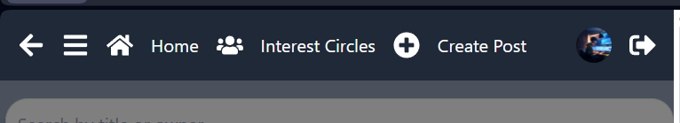
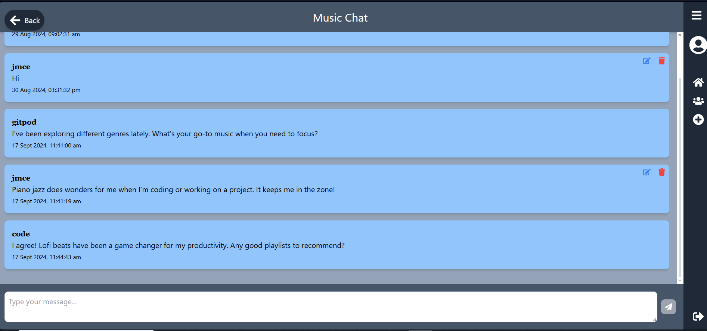

# Learn with Me

[Learn With Me](https://learn-with-me-593ba116ca81.herokuapp.com)

Welcome to **Learn with Me**, the ultimate learning app designed to empower users by sharing and discovering knowledge. Whether you're a student, professional, or lifelong learner, this app is your go-to platform for mastering new skills and expanding your horizons.

## What is *Learn with Me*?

*Learn with Me* is more than just a learning tool—it's a vibrant community where you can:

- **Share Your Wisdom:** Post your tips, tricks, and insights to help others learn more effectively.
- **Discover New Ideas:** Browse posts from fellow users to gain fresh perspectives and innovative techniques.
- **Connect and Collaborate:** Join discussions and chat with like-minded individuals, fostering a collaborative learning environment.

## Planning

### Pages Overview

- **Home/Feed**: 
  - Displays a list of user posts and serves as the main landing page.
  - A sidebar navigation component is used for larger screens, while a standard mobile navbar is available for smaller screens.

- **Profile**:
  - Displays user profile information, recent posts, likes, and follower/following counts.
  - Allows users to easily manage profile-related actions.

- **Interest Circles**:
  - Acts as a groups component to bring users with similar interests together.
  - Design focuses on clarity, making it easy to join and navigate various circles.

- **Chats**:
  - Embedded within Interest Circles, this sub-page allows users to communicate with others in the circle.
  - A simple and user-friendly design keeps the chat intuitive.

### Design

#### Home/Feed

- Set as the design standard for the app. 
- Responsive side navigation is incorporated for larger screens.

#### Profile

- Displays essential user information such as recent activity and posts.
- Includes easy access to profile management options.

#### Interest Circles

- Clear and easy-to-use design for navigating interest circles.

#### Chats

- Focused on user conversations, the chat page is simple, with potential additions like message search and reactions in the future.

---

## Tailwind CSS 

### Why Tailwind CSS?

#### **Design Flexibility**
Tailwind CSS provides utility-first styling, which gives granular control directly in the HTML. This is great for creating custom designs easily without being restricted by predefined components.

#### **Customizability**
Tailwind’s configuration file allows for defining your own design system, including colors, spacing, and breakpoints. This flexibility is a significant advantage when compared to frameworks like Bootstrap.

#### **File Size and Performance**
Tailwind CSS uses PurgeCSS to remove unused styles from the final build, resulting in smaller CSS files and faster load times. This helps keep the performance optimal, unlike Bootstrap's larger default builds.

#### **Summary**
- **Design Flexibility**: Allows for unique and customized designs.
- **Customizability**: Extensively tailors the design system to your project needs.
- **Performance**: Smaller, faster CSS builds due to Tailwind’s purging mechanism.

---

## Features

### Existing Features

- **Sidebar/Navigation Bar**
  - The Sidebar replaces the previous Navigation Bar.
  - The Sidebar displays different icons based on your authentication status:
    - **Logged In**: Home, Interest Circles, Create a Post, Profile Icon, Log Out icon.
    - **Logged Out**: Home, Sign In, Sign Up.
  - The Sidebar is collapsible; even when closed, the icons remain functional as links, so users don't need to expand the Sidebar to change pages.

  
  
  

  
  
  

- **Feed Page**
  - The Feed Page is the landing page for users accessing the app.
  - It displays a list of post cards, with each card linking to the post details page via the post name.
  - Logged-in users can view the post owner's profile page by clicking on the top of the card.
  - Logged-in users can also like posts directly from the Feed Page. Liked posts will display as "Unliked" with a blue color to indicate their status.

  
  

- **Profile Page**
  - The Profile Page displays the user's personal information:
    - Profile Name
    - Profile Picture
    - About Me
    - Follower Count
    - Following Count
    - Depending on whether the user owns the profile:
      - If the owner: Edit Button
      - If not the owner: Follow/Unfollow Button
    - Users can search through their previous posts, sorted by most recent first.
    - The Recent Likes section shows the user's last 10 likes.

  
  

- **Interest Circles Page**
  - The Interest Circles Page is designed for clarity.
  - Each circle displays the interest name, owner, and an info button that shows the circle's description when clicked.
  - If the logged-in user owns the circle, they have the option to delete or edit the circle via a modal.

  
  
  

- **Chat Page**
  - The Chat Page features a simple message interface with a white background for readability.
  - Messages are displayed in a list, starting with the most recent messages at the top. Users can scroll back through older messages.
  - Message owners have edit and delete icons on their messages. Selecting "Edit" allows them to modify their message directly in the input field below, removing the need for a modal and making the process more seamless.

  
  
  

- **Error Modal**
  - The Error Modal handles various errors across different pages.

  

- **Delete Modal**
  - The Delete Modal is used for handling deletions across multiple pages.

  

- **Sign In Page**
  - I wanted the Sign In process to be quick and easy so I just went with a standard login card but to make it easier for people I added a Show/Hide button for password so User can check for any password errors before subbmitting the login.

  

- **SignUp Page**
  - Allows new users to create an account by entering a username and password.
  - Simple and clean form layout for ease of use and clear focus on registration.
  - Ensures passwords match before submission, providing immediate feedback.

  

- **Loading Spinner**
  - I added a loading spinner for cases of the app running slow.

- **Search Bar**
  - The SearchBar component is a customizable search input that allows users to search based on titles or owner names. It features a clear button that appears when a query is entered, enabling users to quickly reset their search filters.

- **Go Back Button**
  - The BackButton component is a fixed-position button that allows users to navigate to the previous page in their browser history. It features an arrow icon and is designed to be both accessible and intuitive.
  - The button was a bit awkward to fit on small screens, so I removed it for small screen sizes.

---

### Features Left to Implement

- Originally, I wanted to enable posts to handle both video and image uploads. However, I found it difficult to implement multimedia operations for anything other than images. This is a feature I would prioritize for future development, given the nature of the platform.
- I planned to implement a share button to allow users to share posts directly to an interest circle or externally by copying the link.
- A notification system is needed to alert users when their posts are liked, commented on, or shared, when they are followed, or when new posts are made in circles they follow.
- **Private Messaging**: I would like to allow users to send direct messages to one another, fostering more personal interactions outside of public posts.
- **Private/Public Circles**: Introducing private circles that require either a password or approval from the group's owner would enhance community management.
- **File Attachments in Chats**: Allowing users to attach documents or other files in chat messages would add another layer of collaboration.

---

## Testing

### Manual Testing

#### Frontend Testing (React)

1. **Navigation**: Tested navigation between Home, Profile, Interest Circles, and Chats.  
   **Result**: All links directed to the correct pages.
   
2. **User Registration and Login**: Tested user registration, login, logout, and restricted page access.  
   **Result**: All functionalities worked as expected, with appropriate redirects for restricted pages.

3. **Profile Page**: Tested editing and viewing profile information.  
   **Result**: Profile updates saved successfully and reflected immediately.

4. **Post Creation**: Tested post creation and image uploads.  
   **Result**: Posts were created and displayed correctly.

5. **Interest Circles**: Tested joining, viewing, and leaving interest circles, as well as sending messages.  
   **Result**: All circle functionalities worked as expected.

6. **Feed Page**: Tested infinite scroll, liking posts, and viewing post details.  
   **Result**: Infinite scroll and interactions with posts worked correctly.

7. **Search Bar**: Tested searching by title or owner name and clearing the search.  
   **Result**: The search bar returned accurate results, and the clear button functioned properly.

8. **Responsive Design**: Tested responsiveness across mobile, tablet, and desktop.  
   **Result**: The app scaled correctly for all screen sizes without layout issues.

#### Backend Testing (Python)

1. **User Authentication API**: Tested user registration, login, and JWT token generation.  
   **Result**: All authentication processes worked correctly.

2. **Post API**: Tested CRUD operations on posts, pagination, and filtering.  
   **Result**: All post-related operations worked without issues.

3. **Interest Circles API**: Tested circle creation, membership management, and CRUD operations.  
   **Result**: Circle functionalities worked as expected.

4. **Messaging API**: Tested message sending and receiving in interest circles.  
   **Result**: Messages were sent and received in real-time.

5. **Error Handling**: Tested API responses for unauthorized access and invalid data.  
   **Result**: Appropriate error messages were returned.

---

### Validator Testing

#### JavaScript (React Frontend)
- **Tool Used**: [ESLint](https://eslint.org/)  
  ESLint was used to validate JavaScript and JSX files, ensuring best practices and compliance with React-specific rules.  
  **Result**: Passed ESLint checks without significant issues.

#### Python (Backend)
- **Tool Used**: [Pylint](https://www.pylint.org/)  
  Pylint was used to ensure code adheres to PEP 8 standards and identify potential issues.  
  **Result**: Passed Pylint checks without significant issues.

---

## Bugs

### Bugs I Faced Along the Way

1. **Slow Loading Times for Large Feeds**: Implemented lazy loading and infinite scroll to handle large amounts of posts and improve performance.
2. **Chat Page Layout on Mobile**: Addressed layout issues on mobile devices with responsive CSS to ensure a consistent chat interface.
3. **Go Back Button Visibility on Small Screens**: Adjusted the button size and position to improve accessibility on mobile.
4. **React Logout Bug**: Encountered a known bug in React where users can sometimes experience issues logging out due to client-side caching or session persistence. This issue occurs when React fails to fully clear the user’s session or authentication state. A workaround was implemented by manually clearing the local storage and session data on logout, but the issue can still occasionally persist under certain conditions.
5. **Circle and Message Handling in DRF**: Initially, when accessing a specific circle, the API would only pull a single message by its ID rather than all the messages associated with that circle. To fix this, I had to create a new endpoint in Django REST Framework (DRF) to handle the proper flow: from the main page > Interest Circles > specific circle > retrieving all chats related to that circle. This change ensures that when a user navigates to a circle, they can see the entire chat history instead of just a single message, improving the overall user experience.
6. **Pulling User’s Recent Posts and Likes**: I encountered difficulties retrieving a specific user's recent posts and recent likes for their profile page. Initially, the query was not pulling the correct data, but by creating custom fields in the serializer, I was able to resolve this issue. This approach allowed me to accurately display both recent posts and likes on the profile page, ensuring that the sections worked as intended.
7. **Pagination on Categories**: Initially, the categories were paginated, and I was limited to displaying only 10 categories. I fixed this by fetching all the categories before rendering the dropdown, ensuring that users could see the full list of categories at once.
8. **Not Enough Space on Navbar**: On smaller screens, not all icons and text fit in the navbar. To resolve this, I created a media query that hides the text on screens under 530px, ensuring the navbar remains clean and functional on small devices.
9. **The Default Image For New Profile**: When a user created a new profile the deafult image wouldnt show, Turns out the pathway in the backend was incorrect.

---

### Bugs Yet to Fix

1. **Error Handling for Network Issues**: Need to implement better notifications for lost network connections or server downtime.
2. **Video Upload Handling**: Video uploads are not yet supported due to difficulties with file size management.
3. **Go Back Button**: Although functional, it still requires further adjustments to improve usability on smaller screens, for now on smaller screen I put it in the navbar. Additionally, the back button pushes back through all previous pages, including forms, instead of stopping at the home page. This can cause the user to continue navigating back farther than expected.
4. **The Sort Order of Chats**: The chat function was difficult to implement correctly, particularly with loading messages in the right order (starting from the bottom with older messages above). Currently, the chat loads at the top and scrolls to the bottom, which may cause a poor user experience in chats with many users.
5. **Circle Name Visibility in Chats**: When entering a chat with no messages, the circle name does not show until a message is sent. This can confuse users as they may not immediately recognize which circle they are in.
6. **401 Unauthorized Error for manifest.json**: The manifest.json file should be publicly accessible, but it is currently returning a 401 error, indicating that authentication is required to access it. This needs to be fixed by ensuring the file is served publicly.
7. **WebSocket Connection Failed**: WebSocket connection issues (`ERR_CONNECTION_TIMED_OUT`) have occurred due to an unreachable or incorrectly configured WebSocket server. This issue remains unresolved and needs further debugging to ensure proper WebSocket communication.
8. **Sorting of Circles After Editing**: When a user edits a circle, the page refreshes and pushes the most recently edited circle to the bottom of the page. This creates a poor user experience, but I currently lack the knowledge to fix it. The desired behavior is to maintain the circle's original position after editing or to allow for customizable sorting.

---

## Deployment

### API Deployment

1. **Prepare the API for Production**: Handled errors gracefully, secured endpoints, and configured environment variables for sensitive data.
2. **Hosting**: Hosted the API on [Heroku](https://heroku.com), integrated with GitHub for continuous deployment.
3. **Deployment Process**: 
   - Created the app on Heroku and linked it to the GitHub repository.  
   - Configured environment variables and ran necessary database migrations.  
   - Monitored performance through Heroku’s dashboard and metrics.

### GitHub

1. **Repository Setup**: The code was managed on GitHub, with branches used for feature development and bug fixes.
2. **Continuous Deployment**: The GitHub repository was linked to Heroku for automatic deployments on push to the main branch.

---

## Credits

### Code
- Protected routes implementation inspired by [Medium](https://medium.com/@yogeshmulecraft/implementing-protected-routes-in-react-js-b39583be0740).
- Tailwind CSS styles and documentation from [Tailwind CSS](https://tailwindcss.com/docs/).
- [Django verbose_name documentation](https://docs.djangoproject.com/en/1.10/ref/models/options/#verbose-name).

### Content
- Wireframes created with [Wireframe.cc](https://wireframe.cc/).
- Database schema diagram created with [dbdiagram.io](https://dbdiagram.io/).
